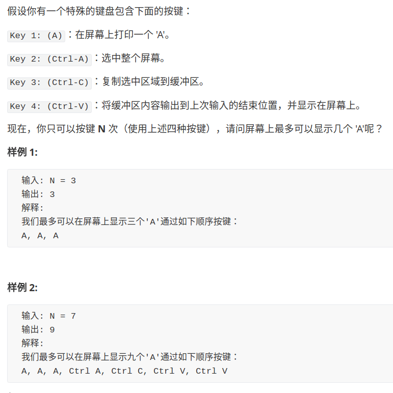

# 动态规划之四键键盘

四键键盘问题很有意思，而且可以明显感受到：对 dp 数组的不同定义需要完全不同的逻辑，从而产生完全不同的解法。

首先看一下题目：



如何在 N 次敲击按钮后得到最多的 A？我们穷举呗，每次有对于每次按键，我们可以穷举四种可能，很明显就是一个动态规划问题。

### 第一种思路

这种思路会很容易理解，但是效率并不高，我们直接走流程：**对于动态规划问题，首先要明白有哪些「状态」，有哪些「选择」**。

具体到这个问题，对于每次敲击按键，有哪些「选择」是很明显的：4 种，就是题目中提到的四个按键，分别是 `A`、`C-A`、`C-C`、`C-V`（`Ctrl` 简写为 `C`）。

接下来，思考一下对于这个问题有哪些「状态」？**或者换句话说，我们需要知道什么信息，才能将原问题分解为规模更小的子问题**？

你看我这样定义三个状态行不行：第一个状态是剩余的按键次数，用 `n` 表示；第二个状态是当前屏幕上字符 A 的数量，用 `a_num` 表示；第三个状态是剪切板中字符 A 的数量，用 `copy` 表示。

如此定义「状态」，就可以知道 base case：当剩余次数 `n` 为 0 时，`a_num` 就是我们想要的答案。

结合刚才说的 4 种「选择」，我们可以把这几种选择通过状态转移表示出来：

```python
dp(n - 1, a_num + 1, copy),    # A
解释：按下 A 键，屏幕上加一个字符
同时消耗 1 个操作数

dp(n - 1, a_num + copy, copy), # C-V
解释：按下 C-V 粘贴，剪切板中的字符加入屏幕
同时消耗 1 个操作数

dp(n - 2, a_num, a_num)        # C-A C-C
解释：全选和复制必然是联合使用的，
剪切板中 A 的数量变为屏幕上 A 的数量
同时消耗 2 个操作数
```

这样可以看到问题的规模 `n` 在不断减小，肯定可以到达 `n = 0` 的 base case，所以这个思路是正确的：

```python
def maxA(N: int) -> int:

    # 对于 (n, a_num, copy) 这个状态，
    # 屏幕上能最终最多能有 dp(n, a_num, copy) 个 A
    def dp(n, a_num, copy):
        # base case
        if n <= 0: return a_num;
        # 几种选择全试一遍，选择最大的结果
        return max(
                dp(n - 1, a_num + 1, copy),    # A
                dp(n - 1, a_num + copy, copy), # C-V
                dp(n - 2, a_num, a_num)        # C-A C-C
            )

    # 可以按 N 次按键，屏幕和剪切板里都还没有 A
    return dp(N, 0, 0)
```

这个解法应该很好理解，因为语义明确。下面就继续走流程，用备忘录消除一下重叠子问题：

```python
def maxA(N: int) -> int:
    # 备忘录
    memo = dict()
    def dp(n, a_num, copy):
        if n <= 0: return a_num;
        # 避免计算重叠子问题
        if (n, a_num, copy) in memo:
            return memo[(n, a_num, copy)]

        memo[(n, a_num, copy)] = max(
                # 几种选择还是一样的
            )
        return memo[(n, a_num, copy)]

    return dp(N, 0, 0)
```

这样优化代码之后，子问题虽然没有重复了，但数目仍然很多，在 LeetCode 提交会超时的。

我们尝试分析一下这个算法的时间复杂度，就会发现不容易分析。我们可以把这个 dp 函数写成 dp 数组：

```python
dp[n][a_num][copy]
# 状态的总数（时空复杂度）就是这个三维数组的体积
```

我们知道变量 `n` 最多为 `N`，但是 `a_num` 和 `copy` 最多为多少我们很难计算，复杂度起码也有 O(N^3) 把。所以这个算法并不好，复杂度太高，且已经无法优化了。

这也就说明，我们这样定义「状态」是不太优秀的，下面我们换一种定义 dp 的思路。

### 第二种思路

这种思路稍微有点复杂，但是效率高。继续走流程，「选择」还是那 4 个，但是这次我们只定义一个「状态」，也就是剩余的敲击次数 `n`。

这个算法基于这样一个事实，**最优按键序列一定只有两种情况**：

要么一直按 `A`：A,A,...A（当 N 比较小时）。

要么是这么一个形式：A,A,...C-A,C-C,C-V,C-V,...C-V（当 N 比较大时）。

因为字符数量少（N 比较小）时，`C-A C-C C-V` 这一套操作的代价相对比较高，可能不如一个个按 `A`；而当 N 比较大时，后期 `C-V` 的收获肯定很大。这种情况下整个操作序列大致是：**开头连按几个 `A`，然后 `C-A C-C` 组合再接若干 `C-V`，然后再 `C-A C-C` 接着若干 `C-V`，循环下去**。

换句话说，最后一次按键要么是 `A` 要么是 `C-V`。明确了这一点，可以通过这两种情况来设计算法：

```java
int[] dp = new int[N + 1];
// 定义：dp[i] 表示 i 次操作后最多能显示多少个 A
for (int i = 0; i <= N; i++) 
    dp[i] = max(
            这次按 A 键，
            这次按 C-V
        )
```

对于「按 `A` 键」这种情况，就是状态 `i - 1` 的屏幕上新增了一个 A 而已，很容易得到结果：

```java
// 按 A 键，就比上次多一个 A 而已
dp[i] = dp[i - 1] + 1;
```
但是，如果要按 `C-V`，还要考虑之前是在哪里 `C-A C-C` 的。

**刚才说了，最优的操作序列一定是 `C-A C-C` 接着若干 `C-V`，所以我们用一个变量 `j` 作为若干 `C-V` 的起点**。那么 `j` 之前的 2 个操作就应该是 `C-A C-C` 了：
 
```java
public int maxA(int N) {
    int[] dp = new int[N + 1];
    dp[0] = 0;
    for (int i = 1; i <= N; i++) {
        // 按 A 键
        dp[i] = dp[i - 1] + 1;
        for (int j = 2; j < i; j++) {
            // 全选 & 复制 dp[j-2]，连续粘贴 i - j 次
            // 屏幕上共 dp[j - 2] * (i - j + 1) 个 A
            dp[i] = Math.max(dp[i], dp[j - 2] * (i - j + 1));
        }
    }
    // N 次按键之后最多有几个 A？
    return dp[N];
}
```

其中 `j` 变量减 2 是给 `C-A C-C` 留下操作数，看个图就明白了：


这样，此算法就完成了，时间复杂度 O(N^2)，空间复杂度 O(N)，这种解法应该是比较高效的了。

### 最后总结

动态规划难就难在寻找状态转移，不同的定义可以产生不同的状态转移逻辑，虽然最后都能得到正确的结果，但是效率可能有巨大的差异。

回顾第一种解法，重叠子问题已经消除了，但是效率还是低，到底低在哪里呢？抽象出递归框架：

```python
def dp(n, a_num, copy):
    dp(n - 1, a_num + 1, copy),    # A
    dp(n - 1, a_num + copy, copy), # C-V
    dp(n - 2, a_num, a_num)        # C-A C-C
```

看这个穷举逻辑，是有可能出现这样的操作序列 `C-A C-C，C-A C-C...` 或者 `C-V,C-V,...`。然这种操作序列的结果不是最优的，但是我们并没有想办法规避这些情况的发生，从而增加了很多没必要的子问题计算。

回顾第二种解法，我们稍加思考就能想到，最优的序列应该是这种形式：`A,A..C-A,C-C,C-V,C-V..C-A,C-C,C-V..`。

根据这个事实，我们重新定义了状态，重新寻找了状态转移，从逻辑上减少了无效的子问题个数，从而提高了算法的效率。

坚持原创高质量文章，致力于把算法问题讲清楚，欢迎关注我的公众号 labuladong 获取最新文章：


[上一篇：团灭 LeetCode 打家劫舍问题](../动态规划系列/抢房子.md)

[下一篇：动态规划之正则表达](../动态规划系列/动态规划之正则表达.md)

[目录](../目录.md)