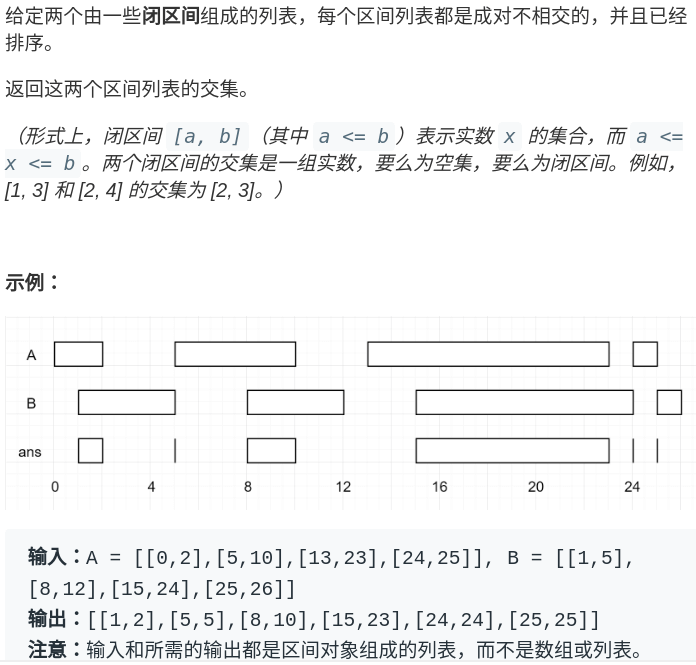
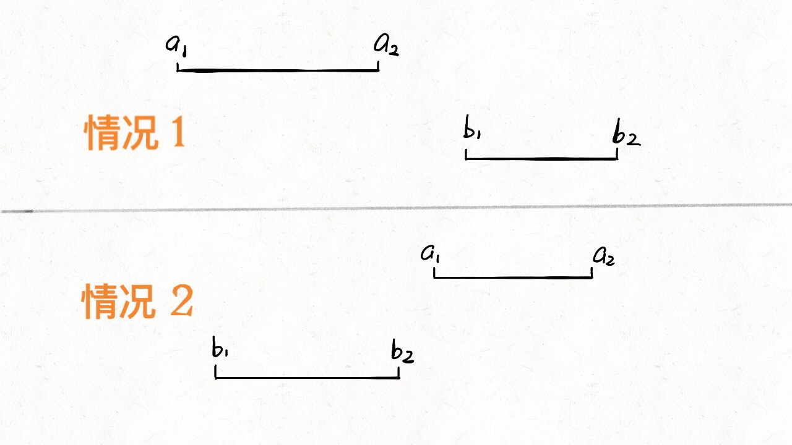
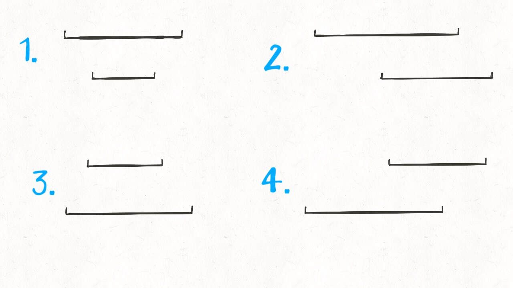
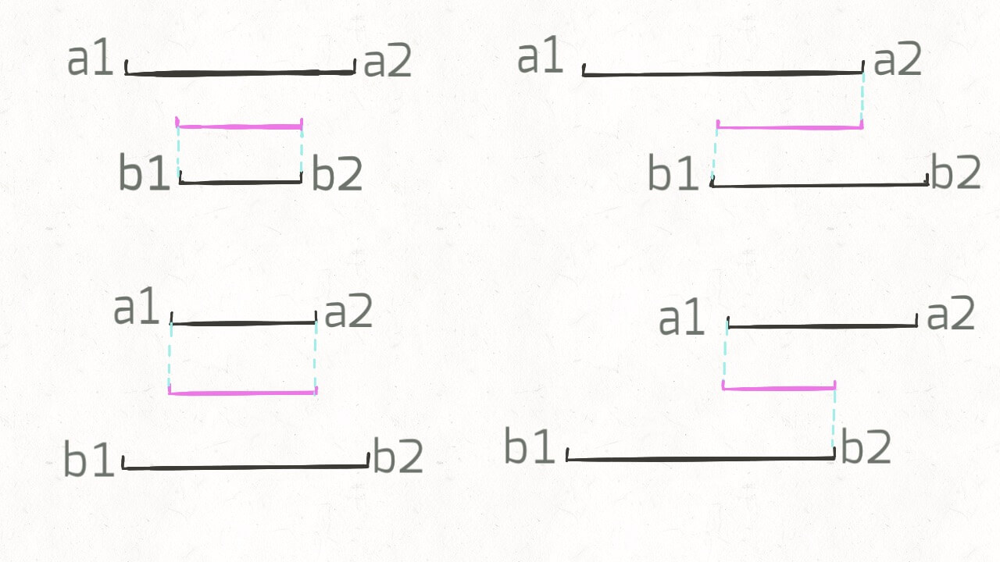

# 区间交集问题

本文是区间系列问题的第三篇，前两篇分别讲了区间的最大不相交子集和重叠区间的合并，今天再写一个算法，可以快速找出两组区间的交集。

先看下题目，LeetCode 第 986 题就是这个问题：



题目很好理解，就是让你找交集，注意区间都是闭区间。

### 思路

解决区间问题的思路一般是先排序，以便操作，不过题目说已经排好序了，那么可以用两个索引指针在 `A` 和 `B` 中游走，把交集找出来，代码大概是这样的：

```python
# A, B 形如 [[0,2],[5,10]...]
def intervalIntersection(A, B):
    i, j = 0, 0
    res = []
    while i < len(A) and j < len(B):
        # ...
        j += 1
        i += 1
    return res
```

不难，我们先老老实实分析一下各种情况。

首先，**对于两个区间**，我们用 `[a1,a2]` 和 `[b1,b2]` 表示在 `A` 和 `B` 中的两个区间，那么什么情况下这两个区间**没有交集**呢：



只有这两种情况，写成代码的条件判断就是这样：

```python
if b2 < a1 or a2 < b1:
    [a1,a2] 和 [b1,b2] 无交集
```

那么，什么情况下，两个区间存在交集呢？根据命题的否定，上面逻辑的否命题就是存在交集的条件：

```python
# 不等号取反，or 也要变成 and
if b2 >= a1 and a2 >= b1:
    [a1,a2] 和 [b1,b2] 存在交集
```

接下来，两个区间存在交集的情况有哪些呢？穷举出来：



这很简单吧，就这四种情况而已。那么接下来思考，这几种情况下，交集是否有什么共同点呢？



我们惊奇地发现，交集区间是有规律的！如果交集区间是 `[c1,c2]`，那么 `c1=max(a1,b1)`，`c2=min(a2,b2)`！这一点就是寻找交集的核心，我们把代码更进一步：

```python
while i < len(A) and j < len(B):
    a1, a2 = A[i][0], A[i][1]
    b1, b2 = B[j][0], B[j][1]
    if b2 >= a1 and a2 >= b1:
        res.append([max(a1, b1), min(a2, b2)])
    # ...
```

最后一步，我们的指针 `i` 和 `j` 肯定要前进（递增）的，什么时候应该前进呢？


结合动画示例就很好理解了，是否前进，只取决于 `a2` 和 `b2` 的大小关系：

```python
while i < len(A) and j < len(B):
    # ...
    if b2 < a2:
        j += 1
    else:
        i += 1
```

### 代码

```python
# A, B 形如 [[0,2],[5,10]...]
def intervalIntersection(A, B):
    i, j = 0, 0 # 双指针
    res = []
    while i < len(A) and j < len(B):
        a1, a2 = A[i][0], A[i][1]
        b1, b2 = B[j][0], B[j][1]
        # 两个区间存在交集
        if b2 >= a1 and a2 >= b1:
            # 计算出交集，加入 res
            res.append([max(a1, b1), min(a2, b2)])
        # 指针前进
        if b2 < a2: j += 1
        else:       i += 1
    return res
```

总结一下，区间类问题看起来都比较复杂，情况很多难以处理，但实际上通过观察各种不同情况之间的共性可以发现规律，用简洁的代码就能处理。

另外，区间问题没啥特别厉害的奇技淫巧，其操作也朴实无华，但其应用却十分广泛，接之前的几篇文章：

坚持原创高质量文章，致力于把算法问题讲清楚，欢迎关注我的公众号 labuladong 获取最新文章：


[上一篇：区间调度之区间合并问题](../算法思维系列/区间调度问题之区间合并.md)

[下一篇：信封嵌套问题](../算法思维系列/信封嵌套问题.md)

[目录](../目录.md)